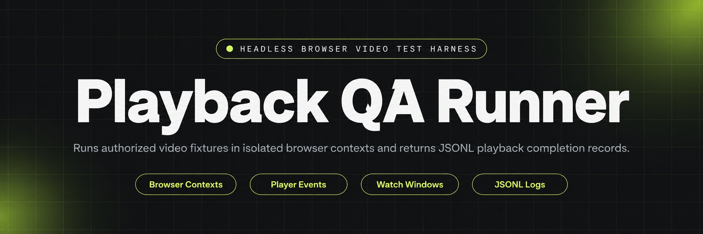
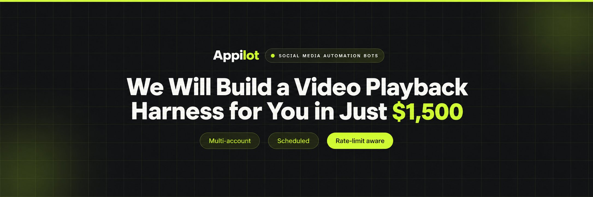
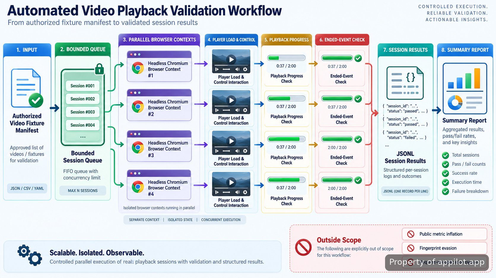

<p align="center">
  <a href="https://www.appilot.app" target="_blank" rel="nofollow">
    
  </a>
</p>

## Video Playback Test Harness

The **Video Playback Test Harness** runs repeatable browser-based playback checks against videos and player pages that I am authorized to test. It launches headless Chromium sessions, opens a supplied test target, exercises the visible player surface, waits through a configured playback window, and records whether playback reached the expected completion condition. The repository is intentionally scoped to QA, regression testing, and owned test environments rather than artificial engagement. YouTube explicitly prohibits systems that artificially increase views or other metrics, so public metric inflation, request-deduplication bypass, fingerprint evasion, and anti-detection behavior are outside this project’s operating model. The relevant policy is documented in <a href="https://support.google.com/youtube/answer/3399767" target="_blank" rel="nofollow">YouTube’s fake engagement policy</a>.

For day-to-day use, the useful unit is a session result, not a platform view count. Each run answers concrete questions: did the page load, did the player become interactive, did playback advance, did the expected media event occur, and did the browser exit cleanly? That makes the harness suitable for validating embeds, custom players, consent flows, playback regressions, and automation changes without pretending that synthetic playback is genuine audience behavior.

<a href="https://www.appilot.app" target="_blank" rel="nofollow">
  
</a>

<p align="center">
  <a href="https://t.me/Bitbash333" target="_blank" rel="nofollow">
    
  </a>&nbsp;
  <a href="https://wa.me/923249868488?text=Hi%2C%20I%27m%20interested." target="_blank" rel="nofollow">
    
  </a>&nbsp;
  <a href="mailto:hello@appilot.app" target="_blank" rel="nofollow">
    
  </a>&nbsp;
  <a href="https://www.appilot.app" target="_blank" rel="nofollow">
    
  </a>
</p>

## Browser playback testing scope

The harness treats the browser as a test instrument. A manifest supplies authorized URLs or local fixtures, playback expectations, and optional selectors for the player surface. The runner opens each target with <a href="https://pptr.dev/api/puppeteer.page.goto" target="_blank" rel="nofollow">Puppeteer navigation</a>, waits for the page to reach the expected state, locates the video element or configured player control, then starts observation. It does not spoof traffic sources, rotate identities to appear as separate viewers, or manipulate network requests to force a remote counter to accept synthetic activity.

The playback window is deterministic by default. That matters for regression work because the same fixture should exercise the same timing path on repeated runs. A short fixture can be allowed to reach its natural end; a longer fixture can use a configured checkpoint such as 30 seconds or 60 seconds, with the result marked as checkpoint-complete rather than media-complete. These values describe test coverage, not a claim about how any third-party platform counts views.

> Use the browser to verify playback behavior you control; do not use it to manufacture engagement you do not.

## Core Features

| Feature | Description |
| --- | --- |
| Headless Chromium automation | Manual replay checks become slow and inconsistent across many fixtures. The runner starts Chromium without a visible UI and executes the same navigation and playback checks on every target. |
| Browser context isolation | Shared cookies or local storage can leak state between QA cases. Separate browser contexts keep storage boundaries independent, matching the isolation model described in the <a href="https://pptr.dev/api/puppeteer.browsercontext" target="_blank" rel="nofollow">Puppeteer BrowserContext documentation</a>. |
| Player-surface interaction | Custom controls can fail even when the media URL itself is healthy. The runner can move the synthetic pointer across configured player elements and click controls through Puppeteer’s documented <a href="https://pptr.dev/api/puppeteer.mouse" target="_blank" rel="nofollow">Mouse API</a>. |
| Deterministic watch windows | Timing regressions are hard to compare when every run uses different behavior. Per-fixture checkpoints make repeat runs comparable and keep the test purpose explicit. |
| Playback completion logging | A successful page load does not prove the video played. The runner records media progress and completion signals, including the browser’s standard <a href="https://developer.mozilla.org/en-US/docs/Web/API/HTMLMediaElement/ended_event" target="_blank" rel="nofollow">ended event</a>. |
| Concurrent browser sessions | Sequential QA becomes tedious when the fixture set grows. A bounded worker pool can run independent authorized checks in parallel while preserving a separate result record for each session. |

## Playback workflow

A run has four stages: manifest loading, isolated browser startup, player observation, and result writing. The manifest is parsed first so invalid targets fail before Chromium is launched. Each accepted case is assigned to the bounded worker pool and opened in its own browser context. Once navigation succeeds, the runner resolves the configured player selector, confirms that playback time is advancing, and watches either for the media to end or for the configured checkpoint to be reached. If a selector is missing, navigation fails, or media time never advances, the case is logged as a failure with the last known stage.

The important distinction is between a browser event and a business metric. The harness can observe `currentTime`, `ended`, page errors, and local timestamps because those are visible inside the test session. It does not assert that a remote analytics service credited a view. For standards behavior, [MDN documents `currentTime`](https://developer.mozilla.org/en-US/docs/Web/API/HTMLMediaElement/currentTime) as the current playback position in seconds, which is the value used for checkpoint tests.



## Tech stack and execution model

The runtime is deliberately small: Node.js coordinates the command-line runner, Puppeteer controls Chromium, browser contexts separate test state, and newline-delimited JSON stores per-session results. <a href="https://developer.chrome.com/docs/automation-and-testing/headless" target="_blank" rel="nofollow">Chrome’s headless documentation</a> describes the browser mode used here, while Puppeteer provides the navigation, page, and input primitives. This stack is a practical fit because the assertions live at the browser layer: page readiness, player controls, media state, console errors, and clean shutdown.

Concurrency is bounded rather than unlimited. The manifest can contain many fixtures, but the runner only starts as many active sessions as the configured worker count allows. That prevents a QA machine from exhausting memory or creating so much contention that playback timing stops being meaningful. A session owns its context from launch through teardown, and teardown happens even after a failed assertion so cookies, storage, and open pages do not bleed into the next case. Context separation is for test hygiene, not for disguising one machine as many unrelated viewers.

<a href="https://tally.so/r/yP5oDx?platform=GitHub&amp;format=Product+repo&amp;brand=Appilot&amp;niche=appilot&amp;page=Video+Playback+Test+Harness+using+Headless+Chromium&amp;date=2026-09-09" target="_blank" rel="nofollow">
  
</a>

## Project directory

The repository keeps configuration, browser control, assertions, and reporting separate so a selector change does not require touching the queue or log writer. Fixtures live outside the runtime code, which makes it straightforward to add owned pages or local test cases without changing the execution path. The logging layer appends one result at a time, using the same basic file-writing model documented by the <a href="https://nodejs.org/api/fs.html" target="_blank" rel="nofollow">Node.js file-system API</a>.

```text
video-playback-test-harness/
├── package.json
├── README.md
├── config/
│   ├── defaults.json
│   └── selectors.json
├── fixtures/
│   ├── owned-videos.json
│   └── player.html
├── src/
│   ├── cli.js
│   ├── manifest.js
│   ├── queue.js
│   ├── browser.js
│   ├── player.js
│   ├── assertions.js
│   └── logger.js
└── reports/
    └── .gitkeep
```

## Video Playback Test Harness

The normal path is install, point the manifest at authorized fixtures, choose a bounded concurrency value, then run the CLI. The repository does not require a public platform account for local fixtures, and no setup step asks for identity rotation, proxy pools, fingerprint masking, or remote counter verification.

- **STEP 1 — Download & Set Up the Project** Install **Video Playback Test Harness** from this repository, run the package install, and keep the supplied defaults until the local fixture passes.
- **STEP 2 — Define Authorized Targets** Add local or owned player URLs to `fixtures/owned-videos.json`, then set the player selector and expected completion mode for each case.
- **STEP 3 — Set Test Coverage** Choose a checkpoint such as 30 or 60 seconds, or select natural media completion, and set a concurrency value appropriate for the QA machine.
- **STEP 4 — Run and Read Results** Start the CLI, then inspect the JSONL session records and summary report for load failures, stalled playback, checkpoint completion, or media completion.

```bash
npm install
npm run qa -- --manifest fixtures/owned-videos.json --concurrency 2
```

## Run records and failure modes

Every case writes a structured record so a failed run can be inspected without replaying the browser manually. The record includes the fixture identifier, target URL, start and end timestamps, navigation outcome, resolved player selector, observed playback position, completion mode, and final status. Browser console errors can be attached to the same session record when they are relevant to debugging. A summary pass then counts passed, failed, and skipped fixtures from those records rather than scraping terminal text.

The most useful failures are explicit: `navigation_failed` when the page cannot be reached, `player_missing` when the selector resolves to nothing, `playback_stalled` when time does not advance, `checkpoint_missed` when the configured window is not reached, and `media_not_completed` when a natural-end test never receives the expected completion signal. None of those statuses imply anything about third-party analytics. They describe only what happened inside the authorized browser session.

```json
{
  "fixture": "local-player-basic",
  "status": "passed",
  "completionMode": "checkpoint",
  "checkpointSeconds": 30,
  "observedSeconds": 30.4
}
```

## Use Cases

- **Regression checks for owned embeds:** confirm that a player still loads, starts, advances, and reaches the configured completion condition after front-end or CDN changes.
- **Custom-control QA:** exercise play, pause, seek, overlay, or consent controls on a player surface and catch selector or event-handling regressions before release.
- **Concurrent fixture validation:** run a bounded set of independent browser playback tests in parallel when a release affects several pages or player variants.
- **Playback telemetry verification:** compare browser-observed media events with application-side test logs without claiming that a public platform credited synthetic engagement.

This is worth setting up when the requirement is repeatable browser playback verification and the targets are yours to test. It is not a substitute for audience acquisition, public metric growth, or any workflow whose success depends on making automated sessions look like unrelated human viewers.

## FAQ

### Can this be used to inflate public video metrics?

No. The repository is scoped to authorized playback QA, and it intentionally excludes artificial engagement, view-count manipulation, fingerprint evasion, and request-deduplication bypass. Public platforms may discard artificial traffic or take enforcement action; the linked YouTube policy explicitly prohibits systems that artificially increase views.

### How are concurrent sessions kept separate?

Each active test case runs in a separate browser context so cookies, local storage, and page state do not leak between fixtures. The isolation exists to keep QA cases independent and reproducible, not to impersonate unrelated viewers or defeat a remote service’s anti-abuse controls.

### What does a completed playback record contain?

A result records the fixture identifier, target, timestamps, navigation outcome, player resolution, observed playback position, completion mode, and final status. For natural-end tests, completion means the browser observed the expected media-end condition; for checkpoint tests, it means the configured playback position was reached.

<table>
  <tr>
    <td align="center" width="33%">
      
      <p>This scraper helped me gather thousands of posts effortlessly. The setup was fast, and exports are super clean and well-structured.</p>
      <p><b>Nathan Pennington</b><br>Marketer<br>★★★★★</p>
    </td>
    <td align="center" width="33%">
      
      <p>What impressed me most was how accurate the extracted data is. Likes, comments, timestamps — everything aligns perfectly.</p>
      <p><b>Greg Jeffries</b><br>SEO Affiliate Expert<br>★★★★★</p>
    </td>
    <td align="center" width="33%">
      
      <p>It's by far the best tool I've used. Ideal for trend tracking, competitor monitoring, and influencer insights.</p>
      <p><b>Karan</b><br>Digital Strategist<br>★★★★★</p>
    </td>
  </tr>
</table>